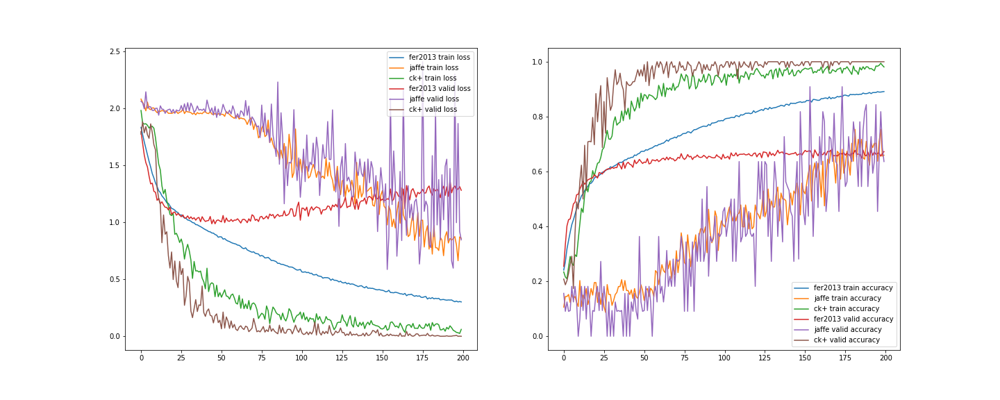

# Facial Expression Recognition System

## Introduction

This project presents a cutting-edge deep learning-based solution for efficient and accurate facial expression recognition. Built upon classical Convolutional Neural Network (CNN) architectures, the system supports training and evaluation across multiple widely recognized public datasets, including FER2013, JAFFE, and CK+. It also features various applications, such as real-time detection and a web-based interface for enhanced accessibility.

By leveraging a comparison between traditional feature extraction techniques and modern deep learning methodologies, this system highlights the superior capabilities of deep models in addressing the challenges of facial expression recognition, especially in complex scenarios such as low-light environments or cluttered backgrounds. Designed with practical use cases in mind, the system is particularly well-suited for applications such as human-computer interaction, psychological analysis, emotion monitoring, and beyond.

------

## Features and Capabilities

- ### 1. **Flexible Model Design**

  - Supports both **traditional feature extraction methods** (e.g., LBP and Gabor) and **state-of-the-art deep learning techniques** (e.g., CNN and MTCNN).
  - Incorporates a CNN architecture inspired by cutting-edge research, utilizing (1,1) convolution layers to enhance non-linear representation while maintaining computational efficiency.
  - Implements data augmentation strategies such as horizontal flipping, angle rotation, and translation to enhance model robustness and inference accuracy.

  ### 2. **High Model Performance**

  - Achieves **67% accuracy** on the FER2013 dataset’s public and private test sets.
  - Attains **99%+ accuracy** in 5-fold cross-validation on the JAFFE and CK+ datasets, reflecting exceptional reliability on high-quality data.

  ### 3. **User-Friendly Applications**

  - **Web-Based Interface**: A user-friendly online platform for facial expression recognition, allowing image upload and instant processing directly within a web browser.
  - **Real-Time Detection**: Enables smooth and efficient real-time facial expression recognition through webcams or video streams.
  - **Robust Inference**: Integrates advanced post-processing strategies to ensure high confidence in classification results.

  ### 4. **Cross-Platform Support**

  - Includes one-click deployment scripts for Linux users, facilitating quick and seamless setup.
  - Fully compatible with mainstream hardware, offering GPU acceleration with CUDA and cuDNN for optimized performance.

------

## Getting Started

### Environment Setup

To ensure compatibility and stability, it is recommended to use a `conda` virtual environment for dependency isolation.

```bash
git clone https://github.com/luanshiyinyang/FacialExpressionRecognition.git
cd FacialExpressionRecognition
conda create -n FER python=3.6 -y
conda activate FER
conda install cudatoolkit=10.1
conda install cudnn=7.6.5 -y
pip install -r requirements.txt

```

For Linux users, a one-click setup script (`env.sh`) is provided. Execute the script as follows:

```
bash env.sh

```

- ## Data Preparation

  Datasets and pre-trained models can be downloaded via [Baidu Netdisk](https://pan.baidu.com/s/1LFu52XTMBdsTSQjMIPYWnw) (password: 2pmd). After downloading:

  - Move `model.zip` to the `models` folder in the root directory and extract it to obtain the `*.h5` model file.
  - Move `data.zip` to the `dataset` folder in the root directory and extract it to access the dataset files. (**It is recommended to use the pre-processed JAFFE dataset included.**)

------

- ## Project Overview

  ### **Traditional Methods**

  - **Data Preprocessing**:
    - Image denoising
    - Face detection using HAAR classifiers (via OpenCV)
  - **Feature Engineering**:
    - Feature extraction using:
      - LBP
      - Gabor
  - **Classifier**:
    - Support Vector Machine (SVM)

  ### **Deep Learning Methods**

  - **Face Detection**:
    - HAAR classifier
    - MTCNN for improved performance
  - **CNN Architecture**:
    - Integrates feature extraction and classification

### **Deep Learning Methods**

- Face Detection

  :

  - HAAR classifier
  - MTCNN (achieves better performance)

- CNN Architecture

  :

  - Combines feature extraction and classification

------

## Network Design

The system employs a classical Convolutional Neural Network architecture, drawing inspiration from leading research papers presented at CVPR 2018 and Google's "Going Deeper" design. A (1,1) convolutional layer is introduced after the input layer to enhance non-linear representation while keeping the model efficient. The architecture maintains a shallow design with most parameters concentrated in the fully connected layers, striking a balance between performance and computational cost.


------



## Model Training

The system has been trained on FER2013, JAFFE, and CK+ datasets. Since JAFFE contains half-body images, face detection was performed as a preprocessing step. Results include:

- **FER2013**: Achieves 67% accuracy on the public and private test sets, despite challenges such as noisy labels and low-quality images in the dataset.
- **JAFFE and CK+**: Achieves over 99% accuracy in 5-fold cross-validation, reflecting strong performance on high-quality, well-labeled datasets.

Training can be initiated using the following command, specifying the dataset (e.g., `fer2013`, `jaffe`, or `ck+`), batch size, and number of epochs. Training logs and performance visualizations will be automatically generated.

```
python src/train.py --dataset fer2013 --epochs 300 --batch_size 32

```

## Model Applications

### **Web-Based Interface**

The system offers a **web-based facial expression recognition application** that is both intuitive and accessible. Users can upload static images through the online interface, allowing the system to automatically detect all faces, classify their expressions, and display results in real time. The processed image, with labeled expressions, is displayed directly in the browser and can be downloaded for further use.

#### Key Features:

1. **Face Detection**: Automatically detects multiple faces in an uploaded image.
2. **Expression Prediction**: Recognizes and classifies facial expressions for all detected faces.
3. **Real-Time Visualization**: Displays the processed image with labeled results directly in the browser.

#### How to Use:

1. Open the web application in your browser (e.g., `http://localhost:5000` for local deployments).
2. Upload an image using the provided upload button.
3. The system processes the image and overlays predictions on the detected faces.
4. View the results directly on the webpage and optionally download the processed image.

#### Example Workflow:

1. **Image Upload**: Drag and drop or select an image file from your device.

2. **Processing**: The server processes the image and runs facial expression recognition.

3. **Results Display**: The processed image with labeled expressions is displayed on the webpage.

   

## Future Vision

Looking ahead, this project aims to integrate more advanced features and expand its applications:

1. **Cross-Domain Generalization**: Enhancing the model's performance on unseen datasets through domain adaptation techniques.
2. **Lightweight Deployment**: Optimizing the model for deployment on edge devices such as mobile phones and IoT cameras.
3. **Advanced Emotion Analysis**: Extending beyond basic emotions to detect subtle facial expressions and micro-expressions.
4. **Multi-Modal Integration**: Incorporating audio and physiological signals for a comprehensive emotion recognition framework.

This project aspires to bridge the gap between academic research and practical applications, creating impactful solutions for real-world emotional intelligence systems.